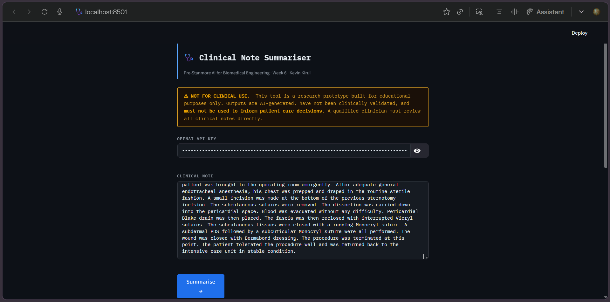
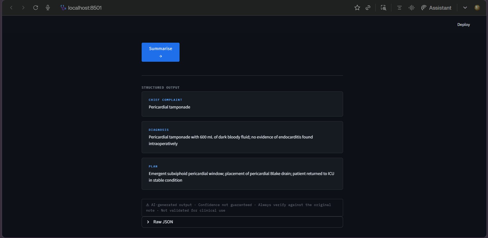

# Clinical Note Assistant

> ⚠️ **NOT FOR CLINICAL USE. DO NOT USE THIS TOOL TO INFORM PATIENT CARE DECISIONS.**
>
> This is an educational prototype built for portfolio demonstration. It has not been clinically validated, lacks required safety controls, and may produce incorrect outputs. Outputs are AI-generated, have not been clinically validated, and **must not be used to inform patient care decisions**. A qualified clinician must review all clinical notes directly. See [REPORT.md](REPORT.md) for validation findings and known failure modes.

[]()
[]()
[]()
[]()

---

## Overview

A Streamlit web application that uses OpenAI's GPT-4o-mini to extract structured information from free-text clinical notes. Given a pasted clinical note, it returns:

- **Chief Complaint**: Patient's primary presenting issue
- **Diagnosis**: Working or confirmed clinical diagnosis
- **Plan**: Treatment approach, medications, procedures, follow-up

Built as part of the **Pre-Stanmore AI for Biomedical Engineering** course (Week 6) to demonstrate LLM API integration, prompt engineering, and clinical AI safety considerations.

---

## Screenshot





---

## Safety & Regulatory Compliance

### Disclaimer Banner

The app displays a persistent disclaimer at the top of every page:

> ⚠ **NOT FOR CLINICAL USE.** This tool is a prototype for educational purposes only. Outputs are generated by an AI model and may be incorrect, incomplete, or misleading. Do not use to inform clinical decisions.

### Per-Output Caveat

Each structured output includes a caveat:

> ⚠ AI-generated output · Confidence not guaranteed · Always verify against the original note · Not validated for clinical use

### Why These Measures Matter

Clinical AI carries unique risks:

- **Errors can harm patients** — Incorrect diagnoses or treatment plans could delay care
- **Hallucinations are common** — LLMs may generate plausible-sounding but false information
- **Omissions are dangerous** — Missing medications, allergies, or conditions could be catastrophic
- **Regulatory compliance is required** — Clinical decision support software must meet MHRA/FDA standards

See [notes/w6d2_safety_design.md](notes/w6d2_safety_design.md) for detailed safety design rationale.

### What This Tool Lacks for Clinical Deployment

- No identity or access control
- No output logging or audit trail
- No clinician-in-the-loop enforcement
- No regulatory conformity assessment (MHRA/FDA)
- No prospective clinical validation

See [REFLECTION.md](REFLECTION.md) for governance requirements analysis.

---

## Installation

```bash
git clone https://github.com/arapkirui513-hub/clinical-note-assistant.git
cd clinical-note-assistant
conda create -n ai-biomed-py311 python=3.11 -y
conda activate ai-biomed-py311
pip install -r requirements.txt
```

---

## Usage

```bash
streamlit run app.py
```

The app will open at http://localhost:8501

1. Enter your OpenAI API key (or set `OPENAI_API_KEY` environment variable)
2. Paste a clinical note into the text area
3. Click "Summarise →"
4. Review the structured output
5. **Verify against the original note before any use**

---

## Project Structure

```
clinical-note-assistant/
├── app.py
├── requirements.txt
├── README.md
├── REPORT.md
├── REFLECTION.md
├── LICENSE
├── .gitignore
├── assets/
│   ├── screenshot1.png
│   └── screenshot2.png
├── notes/
│   ├── w5d1_llm_glossary.md
│   ├── w5d2_clinical_nlp_risks.md
│   ├── w5d5_validation_findings.md
│   └── w6d2_safety_design.md
└── src/
    ├── summarise_v1.py
    └── summarise_v2.py
```

---

## Documentation

| Document | Description |
|----------|-------------|
| [REPORT.md](REPORT.md) | Full project report: use case, dataset, model, evaluation, failure modes |
| [REFLECTION.md](REFLECTION.md) | Governance reflection: data governance, clinician oversight, regulatory pathway |
| [notes/w6d2_safety_design.md](notes/w6d2_safety_design.md) | Safety design rationale for disclaimer and caveat |
| [notes/w5d5_validation_findings.md](notes/w5d5_validation_findings.md) | Manual validation findings and error patterns |

---

## Validation Results

Manual validation on 10 MTSamples notes identified 4 failure patterns:

| Pattern | Description | Mitigation |
|---------|-------------|------------|
| Pre-op diagnosis copying | Model reproduced pre-op diagnosis without checking operative findings | Few-shot example added |
| Quantitative data omission | Medications, weights, device details dropped | Prompt rule added |
| Vague diagnosis | Model outputs generic terms when specificity available | Few-shot examples |
| Reasoning-output disconnect | Reasoning field contradicts diagnosis field | Excluded from UI |

See [REPORT.md](REPORT.md) Section 5 for full analysis.

---

## Limitations

- Single model evaluated (GPT-4o-mini only)
- Small validation set (10 notes)
- No automated evaluation metrics
- No clinician usability study
- No real clinical note testing

---

## License

MIT License. See [LICENSE](LICENSE).

---

## Regulatory Statement

This software is **not a medical device** and is explicitly **not intended for clinical use**. Software that supports clinical decision-making falls under the UK Medical Devices Regulations 2002 (as amended) and the MHRA's AI as a Medical Device framework. A deployed clinical tool would require:

- Conformity assessment by a notified body
- Prospective clinical validation
- Comprehensive audit logging
- Clinician-in-the-loop verification
- Patient consent and data governance

**None of these conditions are met by this prototype.**

---

*Built as part of Pre-Stanmore AI for Biomedical Engineering — Week 6.*
